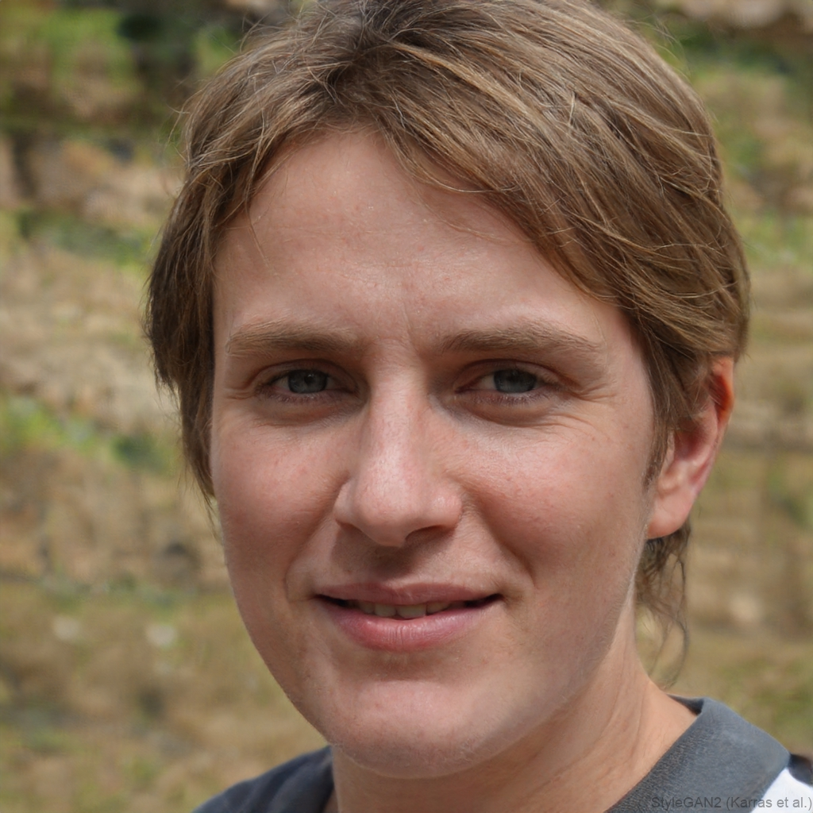
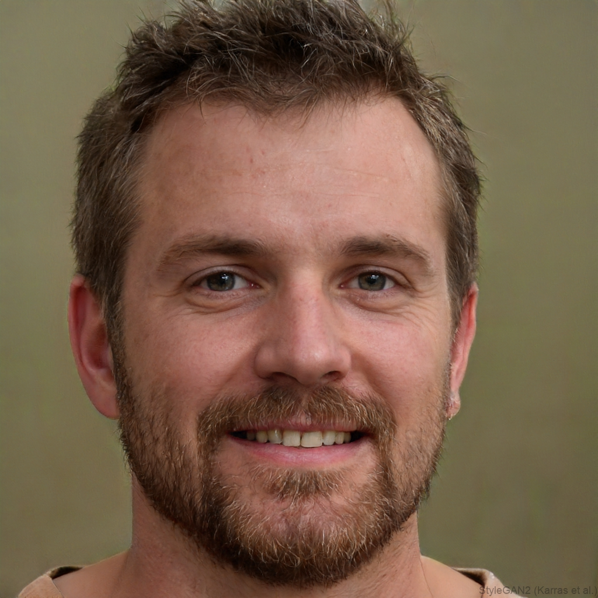

## 1. Persona Primária I: Lucas Ferreira

| Campo | Descrição |
| :--- | :--- |
| **Tipo de Persona** | Persona Primária (Segmento: Praticante Regular Focado em Agilidade) |
| **Idade** | 24 anos |
| **Ocupação** | Analista Júnior / Estudante |
| **Citação** | *"Quero abrir o aplicativo e já saber o que tenho que fazer hoje sem perder tempo."* |
| **Nível de Tecnologia** | Alto — usa smartphone constantemente e tem facilidade com apps modernos. |
| **Objetivos** | Encontrar o treino do dia imediatamente ao abrir o app; registrar cargas e repetições em poucos toques; acompanhar a evolução histórica sem complexidade. |
| **Frustração Principal** | Ter que navegar por telas complexas ou cadastrar dados manualmente no meio do treino; cobrança abusiva por funções básicas como histórico. |

### Mapa de Empatia — Lucas Ferreira

| Quadrante | Descrição |
| :--- | :--- |
| **O que vê** | Salão de musculação movimentado, aparelhos ocupados nos horários de pico, pessoas conferindo anotações ou presas a telas de celulares. |
| **O que ouve** | Reclamações de colegas sobre apps de treino caros e cheios de anúncios; conversas sobre progressão de carga e divisão de treinos. |
| **O que diz e faz** | Treina cerca de 4 vezes por semana; tenta registrar cargas rapidamente entre as séries; alterna a ordem dos exercícios caso o aparelho esteja ocupado. |
| **O que pensa e sente** | Quer otimizar o tempo de treino para não atrasar suas outras obrigações; sente frustração quando perde o ritmo tentando registrar séries em interfaces lentas. |
| **Dores** | Esquecimento dos exercícios do dia; dificuldade de registrar progressão de sobrecarga com agilidade; interfaces burocráticas e excesso de cliques. |
| **Ganhos** | Acesso instantâneo ao treino do dia, interface limpa e objetiva, registro fluido de repetições/cargas e histórico de evolução acessível. |

---

## 2. Persona Primária II: Mariana Alves

| Campo | Descrição |
| :--- | :--- |
| **Tipo de Persona** | Persona Primária (Segmento: Praticante em Fase de Consolidação / Orientação) |
| **Idade** | 26 anos |
| **Ocupação** | Assistente Administrativa |
| **Citação** | *"Quero entender o que preciso fazer sem ter que ficar procurando tudo durante o treino."* |
| **Nível de Tecnologia** | Médio — utiliza apps essenciais do dia a dia (redes sociais, bancos, produtividade básica). |
| **Objetivos** | Ter clareza sobre séries, repetições e intervalos de descanso; executar os movimentos corretamente por meio de suporte visual/instruções; fixar a rotina de treinos. |
| **Frustração Principal** | Aplicativos com catálogo de exercícios limitado, interfaces confusas ou que exigem criação manual de fichas do zero. |

### Mapa de Empatia — Mariana Alves

| Quadrante | Descrição |
| :--- | :--- |
| **O que vê** | Muitas máquinas diferentes na academia, fichas de papel amassadas ou desorganizadas, praticantes experientes executando treinos com autonomia. |
| **O que ouve** | Instrutores com pouco tempo para acompanhamento contínuo; amigos dizendo que "o segredo é a constância e a execução correta". |
| **O que diz e faz** | Tenta manter uma rotina consistente apesar da rotina corrida; consulta anotações no celular com frequência durante o treino; pede ajuda quando tem dúvida. |
| **O que pensa e sente** | Insegura em relação à execução de alguns movimentos e ao tempo ideal de descanso; teme errar e acabar se lesionando ou não tendo resultados. |
| **Dores** | Falta de suporte visual sobre a execução; esquecimento da ordem dos exercícios; perda de tempo procurando detalhes sobre a ficha durante a sessão. |
| **Ganhos** | Instruções claras com suporte visual/vídeo de execução, temporizador automático de descanso, visualização descomplicada de séries e repetições. |

---

## 3. Persona Secundária: André Costa

| Campo | Descrição |
| :--- | :--- |
| **Tipo de Persona** | Persona Secundária (Segmento: Praticante Avançado / Autônomo) |
| **Idade** | 31 anos |
| **Ocupação** | Engenheiro de Software |
| **Citação** | *"O aplicativo deve me ajudar a controlar meu treino, não decidir tudo por mim."* |
| **Nível de Tecnologia** | Muito Alto — avançado, busca personalização profunda e valoriza controle fino de dados. |
| **Objetivos** | Personalizar e reordenar treinos livremente; acompanhar gráficos avançados de progressão de carga; usar o app como ferramenta de registro flexível. |
| **Frustração Principal** | Aplicativos com fluxos rígidos, regras engessadas e falta de flexibilidade para substituir exercícios ou ajustar parâmetros em tempo real. |

### Mapa de Empatia — André Costa

| Quadrante | Descrição |
| :--- | :--- |
| **O que vê** | Aparelhos específicos que utiliza ocupados, pessoas dependendo de treinos genéricos pré-definidos por sistemas automatizados. |
| **O que ouve** | Debates técnicos sobre periodização de treino, volume semanal e técnicas avançadas de hipertrofia. |
| **O que diz e faz** | Treina com frequência alta; memoriza boa parte dos exercícios mas prefere registrar parâmetros técnicos; altera a ordem ou varia exercícios conforme a lotação. |
| **O que pensa e sente** | Quer total autonomia sobre a estrutura do treino; sente que a maioria dos apps no mercado é feita apenas para iniciantes ou é muito engessada. |
| **Dores** | Dificuldade para substituir exercícios rapidamente na sessão; falta de métricas avançadas e gráficos de evolução detalhados; bloqueios do sistema. |
| **Ganhos** | Total flexibilidade para edição de fichas, reordenação de exercícios em tempo real, controle autônomo de descansos e visualização analítica do progresso. |

---

## Resumo Comparativo das Personas

| Persona | Tipo | Segmento Mapeado | Foco Principal | Principal Ponto de Atenção |
| :--- | :--- | :--- | :--- | :--- |
| **Lucas Ferreira** | Primária | Praticante Regular | Agilidade e Registro Rápido | Minimizar toques na tela e abrir direto no treino do dia. |
| **Mariana Alves** | Primária | Praticante em Consolidação | Orientação e Clareza | Oferecer suporte visual de execução e temporizador de descanso. |
| **André Costa** | Secundária | Praticante Autônomo | Personalização e Controle | Permitir edição flexível de séries, cargas e substituição de exercícios. |

---
