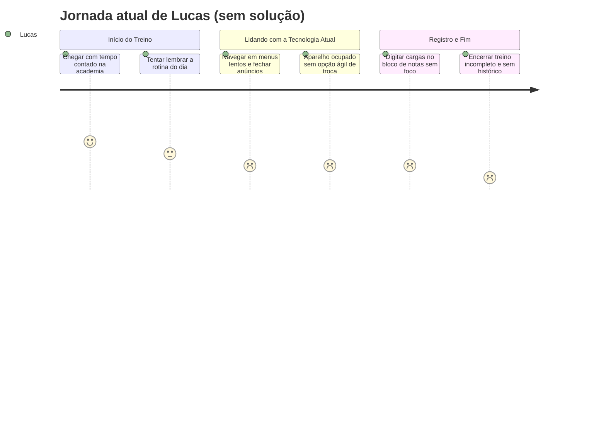
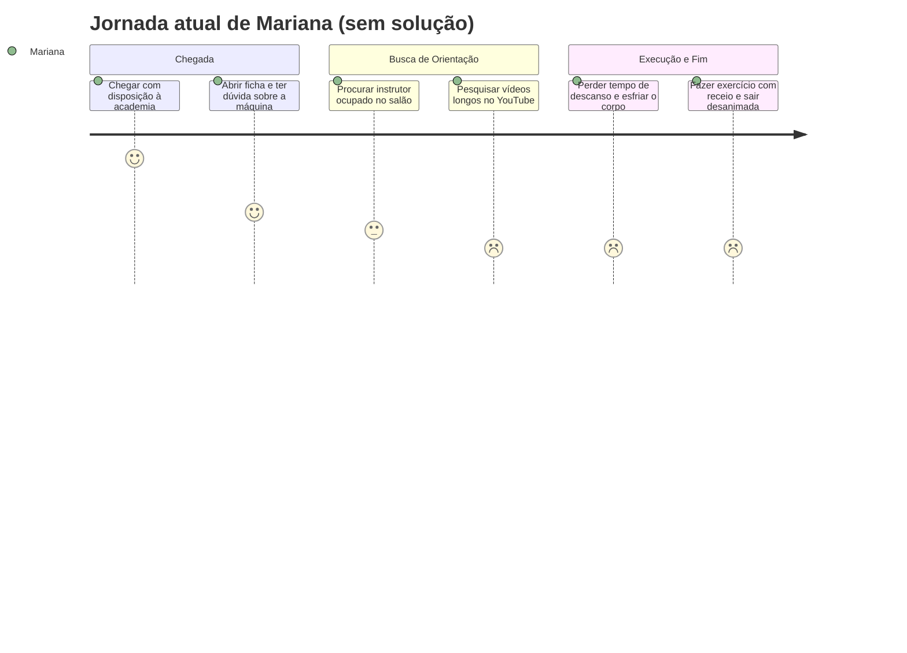
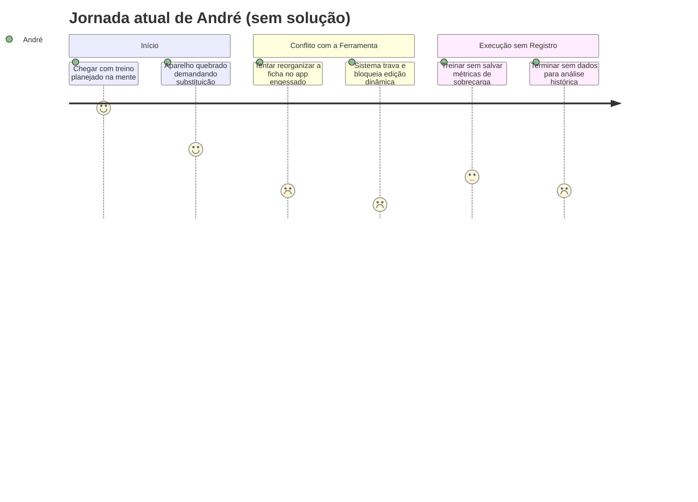

# Cenário de Análise/Problema

> **_NOTE:_**: A equipe deve pensar em cenários existentes na atualidade (que causam problemas para os usuários) e que a interface prevista ajudará a resolver o problema. Cenário de Análise/Problema é uma história triste. Não descreve a solução. Descreve somente o problema.

1) **Cenário de Análise/Problema**
   Lucas sai correndo do estágio no final da tarde e chega à academia no horário de pico, dispondo de apenas 50 minutos para treinar antes de ir para a faculdade. Ao entrar no salão lotado, ele tenta lembrar qual é a ficha do dia e quais aparelhos compõem a sequência, mas percebe que esqueceu a ordem dos exercícios. Ele desbloqueia o celular e tenta consultar o aplicativo genérico que baixou recentemente, mas o app o obriga a passar por anúncios, telas de promoções de plano premium e vários menus confusos até encontrar a lista de exercícios. Quando finalmente localiza o primeiro movimento (supino reto), o banco está ocupado por outro aluno revezando com mais duas pessoas. Sem conseguir substituir o exercício ou alterar a ordem facilmente sem perder o fluxo do treino, Lucas tenta puxar de cabeça qual carga usou na semana passada para fazer outro exercício livre. Ele acaba colocando um peso inadequado, perde o controle do tempo de descanso enquanto tenta fazer anotações soltas no bloco de notas do celular e se desconcentra. No fim, o tempo limite se esgota, ele realizou menos da metade das séries planejadas, não registrou sua evolução e sai da academia frustrado com a sensação de treino perdido.

2) **Questões de Refinamento**
- Esse atrito acontece em todas as sessões de treino ou apenas nos horários de pico da academia?
- Por que Lucas não continua usando fichas de papel físicas da academia ou o bloco de notas padrão do celular?
- O problema principal é a falta de memória de Lucas ou a lentidão/burocracia das interfaces dos aplicativos atuais?
- O que acontece quando um aparelho está ocupado: ele espera desocupar, pula o exercício ou tenta improvisar outro?
- Lucas já tentou assinar outros aplicativos do mercado? Por que desistiu?

3) **Refinamento do Cenário de Análise/Problema**
   Nas quatro vezes por semana em que frequenta a academia, o padrão de frustração de Lucas se repete quase que diariamente: como divide a rotina entre trabalho e estudos, seus treinos precisam ser objetivos e rápidos. A dependência exclusiva da memória falha com frequência na lembrança das cargas e repetições da semana anterior, impedindo a sobrecarga progressiva. Lucas já tentou usar anotações em texto comum no celular, mas a digitação manual de séries, pesos e repetições entre intervalos curtos de descanso é inviável com as mãos suadas e quebra o ritmo do treino. Os aplicativos existentes que ele testou exigem cadastros manuais complexos, possuem interfaces lentas, bloqueiam a consulta ao histórico básico atrás de planos pagos caros e não oferecem flexibilidade para trocar rapidamente a ordem quando um aparelho está ocupado. O problema, portanto, não é falta de motivação para treinar, mas sim o atrito operacional e a perda de tempo causados por ferramentas burocráticas que competem pela atenção do praticante durante a sessão.

4) **Contexto de Uso**
- **Ambiente Físico e Dispositivo:** Salão de musculação barulhento, movimentado e com iluminação artificial intensa; uso de smartphone com apenas uma mão (muitas vezes com a mão suada/trêmula após o esforço físico) e conexões móveis (4G) oscilantes.
- **Contexto Social e Cultural:** Horário de pico (18h–20h), com alta concorrência por aparelhos, necessidade de revezamento constante e pressão implícita de tempo para liberar as máquinas para outros alunos.
- **Contexto Econômico:** Praticantes que já arcam com mensalidade de academia e não desejam pagar assinaturas recorrentes caras apenas para funções básicas de anotação e histórico de treinos.
- **Estado de Atenção:** Atenção dividida e fadiga mental acumulada do trabalho/estudo, exigindo que qualquer interação na tela seja instantânea, com feedback visual claro e o mínimo de cliques possível.

5) **Jornada do Usuário (atual, sem solução)**
   
| Etapa | O que acontece | Estado emocional |
|---|---|---|
| **1. Chegada e Início** | Chega à academia com tempo contado e tenta lembrar qual é o treino e a divisão do dia. | Ansioso / Com pressa |
| **2. Consulta ao App Atual** | Abre o aplicativo e se depara com menus lentos, pop-ups de planos pagos e telas confusas. | Irritado |
| **3. Conflito no Salão** | Encontra o primeiro aparelho ocupado e não consegue reorganizar a sequência de forma prática. | Frustrado |
| **4. Execução e Registro Manual** | Tenta improvisar cargas de memória e registrar anotações manuais no bloco de notas entre as séries. | Desconcentrado / Inseguro |
| **5. Término da Sessão** | O tempo acaba antes de concluir a ficha, sem dados registrados e com o sentimento de estagnação. | Decepcionado |

---

## Persona Primária II

1) **Cenário de Análise/Problema**
   Mariana chega à academia motivada a cumprir sua rotina de fortalecimento físico, mas ainda se sente insegura quanto à execução correta de alguns aparelhos e exercícios com pesos livres. Ao se posicionar para fazer o exercício de puxada e elevação lateral, ela percebe que a ficha de papel amassada que guardava na bolsa molhou e rasgou. Ela tenta procurar no aplicativo da academia, mas o sistema apenas lista o nome técnico do exercício sem nenhuma foto, animação ou dica de postura. Com os instrutores ocupados atendendo vários alunos ao mesmo tempo no salão lotado, Mariana recorre à busca de vídeos no YouTube. Durante a busca, ela perde minutos preciosos assistindo a vídeos longos com introduções desnecessárias, esfria o corpo e perde a noção do tempo de descanso entre as séries. Com receio de executar o movimento errado e sofrer uma lesão, ela reduz o peso drasticamente, pula etapas do treino por vergonha de perguntar e termina o dia sentindo que não aproveitou a ida à academia.
  

2) **Questões de Refinamento**
    Por que Mariana depende de instruções visuais e não consegue tirar dúvidas com os professores da academia?
    
    A falta de suporte visual afeta apenas a velocidade do treino ou também a sua autoconfiança e segurança corporal?
    
    O que faz Mariana desistir de usar os aplicativos de musculação convencionais disponíveis?
    
    Como o tempo gasto buscando referências externas impacta o tempo de intervalo e a eficácia das séries?

3) **Refinamento do Cenário de Análise/Problema**
   Mariana tem uma rotina equilibrada, mas ainda está construindo sua autonomia e confiança nos treinos. Os instrutores do salão raramente estão disponíveis para acompanhar repetição por repetição devido ao excesso de alunos. Quando consulta aplicativos tradicionais, Mariana se depara com catálogos estáticos, falta de ilustrações objetivas sobre postura e ausência de um cronômetro de descanso integrado. A alternância entre aplicativos de treino, reprodutores de vídeo externos e o cronômetro do celular gera sobrecarga cognitiva e vergonha no ambiente social da academia. O problema reside na falta de um suporte visual claro, integrado e de consulta imediata que estruture séries, repetições e intervalos de forma guiada.

4) **Contexto de Uso**
    Ambiente Físico e Dispositivo: Academia com dezenas de aparelhos de nomenclaturas técnicas semelhantes; tela do celular utilizada para consulta de orientações visuais rápidas.
    
    Contexto Social e Cultural: Sentimento de intimidação em ambientes cheios com praticantes mais experientes; escassez de tempo dos instrutores para acompanhamento individual. 
    
    Contexto Econômico: Necessidade de suporte sem a possibilidade de contratar um personal trainer exclusivo para acompanhar todas as sessões.
    
    Estado de Atenção: Foco na postura e medo de errar a técnica corporal, exigindo instruções diretas e sem ruídos visuais. 

5) **Jornada do Usuário (atual, sem solução)**
   
| Etapa | O que acontece | Estado emocional |
| :---- | :---- | :---- |
| **1. Início da Sessão** | Chega à academia e tenta conferir os exercícios programados na ficha. | Confiante / Motivada |
| **2. Dúvida na Execução** | Encontra nomes de exercícios complexos e não sabe regular a máquina ou ajustar a postura. | Insegura |
| **3. Procura por Referências** | Instrutores estão ocupados; abre plataformas de vídeo para tentar aprender o movimento. | Ansiosa / Tímida |
| **4. Quebra de Ritmo** | O descanso passa do tempo correto, perde o ritmo do treino e fica envergonhada. | Desconfortável |
| **5. Saída Precoce** | Faz execuções incompletas com medo de lesão e encerra o treino frustrada. | Decepcionada |

---

## Persona Secundária

1) **Cenário de Análise/Problema**
   André é um praticante avançado que treina com foco em hipertrofia e periodização técnica. Ao chegar à academia para um treino de pernas volumoso, ele encontra o leg press interditado para manutenção e o rack de agachamento com fila de espera. Ele abre seu aplicativo atual para substituir esses exercícios por variações equivalentes (como agachamento búlgaro e hack machine) e reorganizar a ordem para não prejudicar seu rendimento. No entanto, o sistema possui um fluxo completamente engessado: não permite trocar a ordem dos exercícios sem recriar o treino do zero, impõe limites arbitrários sobre o número de séries por grupo muscular e bloqueia a inserção de anotações personalizadas de parâmetros técnicos. Irritado com as travas e mensagens de erro do sistema, André desiste do aplicativo, faz as substituições de cabeça e fica sem registrar os pesos e repetições alcançados na sessão, perdendo o controle fino dos seus gráficos de sobrecarga progressiva.

 2) **Questões de Refinamento**
    Por que André não se adapta aos treinos padrões sugeridos pela maioria dos sistemas?

    Como a rigidez dos aplicativos atrapalha o planejamento e a periodização de médio e longo prazo?
    
    O que acontece com a motivação e o engajamento de um usuário experiente quando o software restringe sua autonomia?
    
    Quais ferramentas André já tentou utilizar (como planilhas eletrônicas) e quais foram os pontos de atrito?

3) **Refinamento do Cenário de Análise/Problema**
   Como praticante veterano, André tem conhecimento técnico suficiente para montar e adaptar seus próprios treinos. Ele já tentou utilizar planilhas eletrônicas no celular, mas a interface das tabelas é pouco ergonômica para manipulação durante a pegada de pesos. Por outro lado, os aplicativos do mercado tratam todos os usuários como iniciantes, forçando fluxos guiados pré-determinados, impedindo ajustes livres de séries/cargas em tempo real e bloqueando a reorganização dinâmica da sequência quando aparelhos estão ocupados ou com defeito. O problema central é o excesso de regras rígidas e a falta de controle flexível de dados nos softwares de treino atuais.

4) **Contexto de Uso**
   Ambiente Físico e Dispositivo: Salão de musculação de alta intensidade; interação rápida entre séries de alto esforço com visualização analítica.

   Contexto Social e Cultural: Praticantes autônomos que não precisam de acompanhamento pedagógico básico, mas demandam ferramentas que não interfiram em suas decisões.
    
   Contexto Econômico: Usuários dispostos a utilizar ferramentas completas, desde que não imponham paywalls para funcionalidades operacionais simples.
    
   Estado de Atenção: Foco analítico em métricas (RPE, volume total, quilagem, tempo sob tensão), exigindo liberdade para manusear dados brutos com facilidade.

5) **Jornada do Usuário (atual, sem solução)**

| Etapa | O que acontece | Estado emocional |
| :--- | :--- | :--- |
| **1. Planejamento do Treino** | Chega sabendo a meta de volume e cargas do dia. | Confiante / Focado |
| **2. Bloqueio no Salão** | Aparelho principal quebrado/ocupado, exigindo substituição imediata. | Neutro / Pragmático |
| **3. Tentativa de Ajuste no App** | O app não permite alterar a ordem, substituir exercício nem editar parâmetros avançados. | Extremamente Irritado |
| **4. Treino Desconectado** | Abandona o app e faz o treino sem registrar variáveis analíticas. | Desanimado com a ferramenta |
| **5. Fechamento da Sessão** | Encerra sem métricas atualizadas na sua série histórica de progressão. | Frustrado |

   
