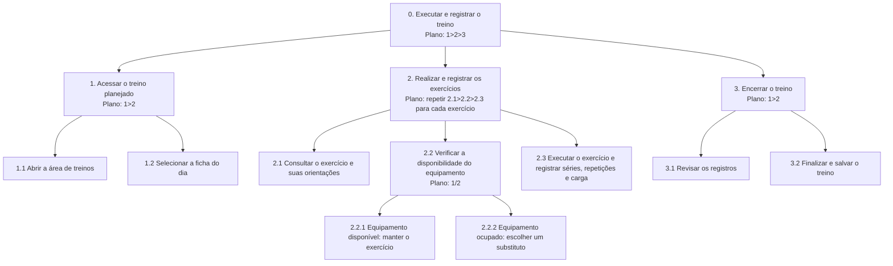

# Análise de Tarefas

> **_NOTE:_**: Enquanto o Cenário de Análise/Problema descreve a situação em prosa, a Análise de Tarefas modela formalmente como o usuário executa as funcionalidades mais importantes da interface/produto. Isso alimenta diretamente a Arquitetura de Informação e o Fluxo do Usuário na próxima etapa.
# Análise de Tarefas — Aplicativo de Organização e Acompanhamento de Treinos

## 1. HTA — Executar e registrar o treino do dia

**Funcionalidade:** permitir que o usuário acesse sua ficha de treino, consulte os exercícios planejados, registre séries, repetições e cargas e finalize o treino.

O HTA (Hierarchical Task Analysis) representa a tarefa de executar um treino por meio de uma estrutura hierárquica, dividindo o objetivo principal em subtarefas e operações menores. Essa organização permite compreender as etapas necessárias para concluir a atividade e identificar situações que podem interferir na experiência do usuário, como a indisponibilidade de um equipamento.

### Diagrama HTA



### Explicação dos planos de execução

* **Plano 0 (`1>2>3`):** o usuário acessa o treino planejado, realiza e registra os exercícios e, por último, encerra o treino.
* **Plano 1 (`1>2`):** primeiro, abre a área de treinos e, depois, seleciona a ficha do dia.
* **Plano 2:** para cada exercício da ficha, o usuário consulta as orientações, verifica a disponibilidade do equipamento e executa o exercício registrando os dados. Essa sequência é repetida até que todos os exercícios sejam tratados.
* **Plano 2.2 (`1/2`):** se o equipamento estiver disponível, o usuário mantém o exercício planejado; caso esteja ocupado, seleciona um exercício substituto. As alternativas são excludentes para cada exercício.
* **Plano 3 (`1>2`):** o usuário revisa os registros e, em seguida, finaliza e salva o treino.

A funcionalidade busca reduzir as dificuldades relacionadas à organização dos exercícios e ao registro das informações durante a atividade física. Ao manter as etapas organizadas, o aplicativo pode facilitar o acompanhamento do treino e diminuir a necessidade de recorrer a anotações externas.

## 2. GOMS — Criar uma ficha de treino personalizada

**Funcionalidade:** permitir que o usuário crie uma ficha de treino selecionando exercícios e definindo seus respectivos parâmetros.

O modelo GOMS (Goals, Operators, Methods e Selection Rules) descreve os objetivos do usuário, os métodos disponíveis para alcançá-los, as condições para escolher cada método e as ações necessárias durante a interação.

```text
GOAL 0: criar uma ficha de treino personalizada

  GOAL 1: iniciar a criação da ficha

    METHOD 1.A: criar uma ficha vazia
      (SEL. RULE: escolher este método quando o usuário quiser montar a ficha desde o início)
      OP. 1.A.1: tocar em "Criar ficha"
      OP. 1.A.2: selecionar "Ficha vazia"
      OP. 1.A.3: verificar se o formulário foi aberto

    METHOD 1.B: começar a partir de um modelo
      (SEL. RULE: escolher este método quando houver um modelo adequado para personalizar)
      OP. 1.B.1: tocar em "Criar ficha"
      OP. 1.B.2: abrir a lista de modelos
      OP. 1.B.3: selecionar um modelo
      OP. 1.B.4: tocar em "Personalizar modelo"

  GOAL 2: definir os dados da ficha
    METHOD 2.A: preencher os dados da ficha
      OP. 2.A.1: tocar no campo de nome
      OP. 2.A.2: digitar o nome da ficha
      OP. 2.A.3: revisar o nome informado

  GOAL 3: adicionar exercícios à ficha
    METHOD 3.A: selecionar exercícios na biblioteca
      OP. 3.A.1: abrir a biblioteca de exercícios
      OP. 3.A.2: pesquisar ou percorrer a lista de exercícios
      OP. 3.A.3: selecionar um exercício
      OP. 3.A.4: informar séries, repetições e, se necessário, a carga planejada
      OP. 3.A.5: confirmar a inclusão do exercício
      OP. 3.A.6: repetir as operações 3.A.2 a 3.A.5 para cada exercício desejado

  GOAL 4: salvar a ficha
    METHOD 4.A: salvar e conferir a ficha
      OP. 4.A.1: tocar em "Salvar ficha"
      OP. 4.A.2: verificar a confirmação de salvamento
      OP. 4.A.3: conferir se a ficha aparece na lista de treinos
```

### Explicação da funcionalidade

A criação de uma ficha personalizada permite que o usuário organize os exercícios de acordo com sua rotina e seus objetivos. Ele pode iniciar uma ficha vazia ou utilizar um modelo existente, preencher os dados necessários e adicionar exercícios à biblioteca. Para cada exercício, configura séries, repetições e outros parâmetros pertinentes. Como uma ficha pode conter vários exercícios, as operações de seleção e configuração são repetidas conforme necessário. A tarefa termina quando a ficha é salva e sua presença na lista de treinos é confirmada.

## 3. GOMS — Substituir um exercício quando o equipamento estiver ocupado

**Funcionalidade:** permitir que o usuário substitua um exercício quando não puder utilizar o equipamento planejado, mantendo a continuidade do treino.

```text
GOAL 0: substituir um exercício indisponível

  GOAL 1: acessar as opções de substituição
    METHOD 1.A: iniciar a substituição durante o treino
      OP. 1.A.1: localizar o exercício cujo equipamento está ocupado
      OP. 1.A.2: tocar em "Substituir exercício"
      OP. 1.A.3: observar as opções apresentadas

  GOAL 2: escolher o exercício substituto

    METHOD 2.A: selecionar uma sugestão do aplicativo
      (SEL. RULE: escolher este método quando houver uma sugestão adequada disponível)
      OP. 2.A.1: ler as informações da sugestão
      OP. 2.A.2: verificar se o exercício pode ser realizado com os equipamentos disponíveis
      OP. 2.A.3: selecionar a sugestão desejada
      OP. 2.A.4: confirmar a substituição

    METHOD 2.B: pesquisar outro exercício
      (SEL. RULE: escolher este método quando nenhuma sugestão apresentada for adequada)
      OP. 2.B.1: abrir a biblioteca de exercícios
      OP. 2.B.2: digitar o nome do exercício ou aplicar um filtro
      OP. 2.B.3: analisar os resultados
      OP. 2.B.4: selecionar o exercício adequado
      OP. 2.B.5: confirmar a substituição

  GOAL 3: retomar o treino
    METHOD 3.A: conferir a alteração e continuar
      OP. 3.A.1: verificar se o exercício substituto aparece na ficha
      OP. 3.A.2: consultar as orientações do exercício selecionado
      OP. 3.A.3: iniciar a execução do exercício substituto
```

### Explicação da funcionalidade

A substituição de exercícios busca resolver uma situação comum nas academias: a indisponibilidade de um equipamento. O usuário pode selecionar uma sugestão apresentada pelo aplicativo ou pesquisar outra opção. Depois de confirmar a substituição, verifica se a ficha foi atualizada e consulta as orientações antes de continuar o treino.

Essa funcionalidade pode tornar o aplicativo mais flexível, mas as sugestões de substituição devem ser adequadas ao exercício original e às condições do usuário. A simples semelhança entre exercícios não garante que eles sejam equivalentes em todos os contextos.

## 4. GOMS — Consultar a evolução de um exercício

**Funcionalidade:** permitir que o usuário consulte registros anteriores e compare informações de um exercício, como cargas utilizadas, séries e repetições.

```text
GOAL 0: consultar a evolução de um exercício

  GOAL 1: acessar o histórico do exercício

    METHOD 1.A: acessar pela área de progresso
      (SEL. RULE: escolher este método quando o usuário estiver na tela inicial ou quiser consultar o histórico geral)
      OP. 1.A.1: abrir a área "Progresso" ou "Histórico"
      OP. 1.A.2: localizar ou pesquisar o exercício
      OP. 1.A.3: selecionar o exercício desejado

    METHOD 1.B: acessar a partir da ficha de treino
      (SEL. RULE: escolher este método quando o usuário já estiver visualizando uma ficha que contém o exercício)
      OP. 1.B.1: abrir a ficha de treino
      OP. 1.B.2: localizar o exercício
      OP. 1.B.3: abrir os detalhes do exercício
      OP. 1.B.4: selecionar "Histórico" ou "Ver progresso"

  GOAL 2: analisar os registros anteriores
    METHOD 2.A: consultar os dados apresentados
      OP. 2.A.1: verificar as datas dos registros
      OP. 2.A.2: comparar as cargas utilizadas
      OP. 2.A.3: comparar as séries e repetições registradas
      OP. 2.A.4: identificar as mudanças entre os registros disponíveis
```

### Explicação da funcionalidade

O histórico permite que o usuário consulte os dados registrados em sessões anteriores e compare seu desempenho ao longo do tempo. O acesso pode acontecer pela área geral de progresso ou diretamente pela ficha de treino. Depois de abrir o histórico do exercício, o usuário analisa as datas, cargas, séries e repetições registradas.

A apresentação dessas informações deve ser clara e facilitar a comparação entre sessões. O aplicativo deve evitar conclusões automáticas sobre evolução com base em um único indicador, pois o desempenho pode depender de diferentes fatores.

## 5. Relação com a pesquisa com usuários

As funcionalidades analisadas estão relacionadas às necessidades identificadas na pesquisa:

* **Organização dos treinos:** criação de fichas personalizadas para facilitar o planejamento.
* **Registro de exercícios e cargas:** execução do treino com registro de séries e repetições.
* **Indisponibilidade de equipamentos:** substituição de exercícios para ajudar a manter a continuidade da atividade.
* **Acompanhamento da evolução:** consulta ao histórico para comparar registros anteriores.

## 6. Conclusão

A análise contempla um HTA e três modelos GOMS, cobrindo quatro funcionalidades do aplicativo: executar e registrar o treino, criar uma ficha personalizada, substituir um exercício e consultar a evolução.

O HTA apresenta a decomposição hierárquica da execução do treino e os planos de execução de cada nó com múltiplos filhos. Os modelos GOMS detalham os objetivos, métodos alternativos, regras de seleção e operadores envolvidos nas demais tarefas.

Esses modelos podem orientar a arquitetura da informação, o desenho das telas e a definição dos fluxos de navegação do aplicativo. Os nomes de telas e botões apresentados são propostas que deverão ser adequadas ao protótipo final.
