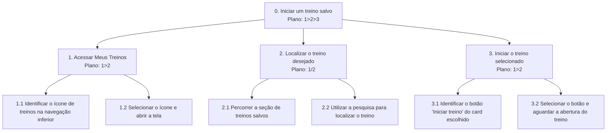

# Análise de Tarefas — Aplicativo de Treinos

## 1. HTA — Iniciar um treino salvo

**Funcionalidade:** permitir que o usuário localize um treino salvo na tela “Meus Treinos” e inicie sua execução.

O HTA (Hierarchical Task Analysis) decompõe a tarefa em etapas menores para representar como o usuário interage com a interface até iniciar um treino. O modelo considera os elementos apresentados no protótipo, incluindo a navegação inferior, a seção de treinos salvos e o botão “Iniciar treino”.

### Diagrama HTA



### Planos de execução

* **Plano 0 (`1>2>3`):** acessar a tela de treinos, localizar o treino desejado e iniciar sua execução.
* **Plano 1 (`1>2`):** identificar o ícone de treinos na navegação inferior e selecioná-lo para abrir a tela “Meus Treinos”.
* **Plano 2 (`1/2`):** localizar o treino percorrendo a lista de treinos salvos ou utilizando a pesquisa. O usuário escolhe uma dessas alternativas conforme sua necessidade.
* **Plano 3 (`1>2`):** identificar o botão “Iniciar treino” correspondente ao treino escolhido e selecioná-lo.

### Explicação da funcionalidade

A tela “Meus Treinos” apresenta exercícios mais praticados e uma seção de treinos salvos. Cada treino salvo pode apresentar informações resumidas, como o nome da ficha e a data do último treino, além do botão “Iniciar treino”.

O usuário acessa essa tela pela navegação inferior, localiza a ficha desejada e inicia a atividade pelo botão correspondente. A organização das informações busca facilitar o acesso aos treinos e reduzir o tempo gasto procurando uma ficha.

O protótipo também apresenta o botão “Iniciar novo treino”, que representa um caminho alternativo para começar uma atividade, sem necessariamente selecionar uma ficha salva.

---

## 2. GOMS — Interagir com uma publicação na tela inicial

**Funcionalidade:** permitir que o usuário interaja com as publicações da comunidade por meio das opções de curtir, comentar e compartilhar.

```text
GOAL 0: interagir com uma publicação na tela inicial

  GOAL 1: localizar a publicação desejada
    METHOD 1.A: selecionar uma publicação no feed
      OP. 1.A.1: acessar a tela inicial
      OP. 1.A.2: percorrer as publicações apresentadas
      OP. 1.A.3: identificar a publicação desejada

  GOAL 2: escolher uma forma de interação

    METHOD 2.A: curtir a publicação
      (SEL. RULE: escolher este método quando quiser demonstrar que gostou da publicação)
      OP. 2.A.1: identificar o ícone de coração
      OP. 2.A.2: tocar no ícone de coração
      OP. 2.A.3: verificar a alteração visual do ícone

    METHOD 2.B: comentar a publicação
      (SEL. RULE: escolher este método quando quiser escrever uma mensagem sobre a publicação)
      OP. 2.B.1: identificar e tocar no ícone de comentário
      OP. 2.B.2: aguardar a abertura da área de comentários
      OP. 2.B.3: inserir o comentário
      OP. 2.B.4: enviar o comentário

    METHOD 2.C: compartilhar a publicação
      (SEL. RULE: escolher este método quando quiser compartilhar a publicação)
      OP. 2.C.1: identificar e tocar no ícone de compartilhamento
      OP. 2.C.2: visualizar as opções apresentadas
      OP. 2.C.3: selecionar uma opção de compartilhamento
      OP. 2.C.4: verificar o resultado da ação
```

### Explicação da funcionalidade

A tela inicial apresenta publicações de usuários relacionadas à rotina de treinos. Cada publicação contém informações sobre o autor, o conteúdo compartilhado e, em alguns casos, um resumo do treino, incluindo duração e calorias informadas. Abaixo de cada publicação aparecem os ícones de coração, comentário e compartilhamento.

O usuário pode selecionar uma publicação e escolher uma dessas formas de interação. Cada ação possui uma sequência própria de operações, desde o reconhecimento do ícone até a confirmação da interação.

As etapas posteriores ao toque nos ícones representam o comportamento esperado da funcionalidade. A forma exata de comentar e compartilhar deverá ser confirmada durante o desenvolvimento, pois o protótipo ainda não apresenta as telas correspondentes.

---

## 3. GOMS — Iniciar um novo treino

**Funcionalidade:** permitir que o usuário inicie um treino por meio do botão “Iniciar novo treino”, apresentado na tela “Meus Treinos”.

```text
GOAL 0: iniciar um novo treino

  GOAL 1: acessar a funcionalidade de novo treino
    METHOD 1.A: utilizar o botão da tela Meus Treinos
      OP. 1.A.1: acessar a tela Meus Treinos pela navegação inferior
      OP. 1.A.2: localizar o botão "Iniciar novo treino"
      OP. 1.A.3: tocar no botão
      OP. 1.A.4: aguardar a abertura da próxima tela

  GOAL 2: prosseguir com o início do treino
    METHOD 2.A: seguir as opções apresentadas pelo aplicativo
      OP. 2.A.1: verificar as informações exibidas na próxima tela
      OP. 2.A.2: identificar as opções disponíveis para iniciar o treino
      OP. 2.A.3: selecionar a opção adequada
      OP. 2.A.4: confirmar a ação, caso solicitado
```

### Explicação da funcionalidade

O botão “Iniciar novo treino” permite que o usuário comece uma nova atividade a partir da tela “Meus Treinos”. Após selecioná-lo, o aplicativo deverá apresentar as próximas etapas necessárias para iniciar o treino.

Como o protótipo não mostra a tela seguinte nem define se o usuário deverá escolher exercícios, montar uma ficha ou simplesmente iniciar uma sessão livre, o modelo não pressupõe uma dessas alternativas. O fluxo deverá ser detalhado quando a equipe definir esse comportamento.

---

## 4. GOMS — Consultar as opções do perfil

**Funcionalidade:** permitir que o usuário acesse o próprio perfil e selecione uma das áreas disponíveis, como histórico de treino, metas de peso, conquistas ou configurações.

```text
GOAL 0: consultar uma área do perfil

  GOAL 1: acessar a tela Meu Perfil
    METHOD 1.A: utilizar o ícone de perfil na navegação inferior
      OP. 1.A.1: identificar o ícone de perfil na barra inferior
      OP. 1.A.2: tocar no ícone
      OP. 1.A.3: aguardar a abertura da tela Meu Perfil

  GOAL 2: selecionar a área desejada

    METHOD 2.A: consultar o histórico de treino
      (SEL. RULE: escolher este método quando quiser consultar registros anteriores de treino)
      OP. 2.A.1: localizar a opção "Histórico de treino"
      OP. 2.A.2: tocar na opção
      OP. 2.A.3: verificar se a área correspondente foi aberta

    METHOD 2.B: acessar as metas de peso
      (SEL. RULE: escolher este método quando quiser consultar ou gerenciar suas metas de peso)
      OP. 2.B.1: localizar a opção "Metas de peso"
      OP. 2.B.2: tocar na opção
      OP. 2.B.3: verificar se a área correspondente foi aberta

    METHOD 2.C: consultar as conquistas
      (SEL. RULE: escolher este método quando quiser visualizar suas conquistas no aplicativo)
      OP. 2.C.1: localizar a opção "Minhas Conquistas"
      OP. 2.C.2: tocar na opção
      OP. 2.C.3: verificar se a área correspondente foi aberta

    METHOD 2.D: acessar as configurações
      (SEL. RULE: escolher este método quando quiser consultar ou alterar as configurações disponíveis)
      OP. 2.D.1: localizar a opção "Configurações"
      OP. 2.D.2: tocar na opção
      OP. 2.D.3: verificar se a área correspondente foi aberta
```

### Explicação da funcionalidade

A tela “Meu Perfil” reúne informações sobre o usuário, quantidade de treinos, seguidores e pessoas seguidas. Também apresenta um gráfico de atividade semanal, opções para acessar o histórico de treino, metas de peso, conquistas e configurações, além de um resumo do último registro de treino.

O modelo GOMS representa o acesso a essas áreas como métodos alternativos. O usuário escolhe o caminho conforme seu objetivo: consultar registros anteriores, verificar metas, visualizar conquistas ou acessar configurações.

A organização dessas opções em uma única tela facilita a localização de informações pessoais e funcionalidades relacionadas ao acompanhamento da rotina de exercícios.

---

## 5. Relação com a pesquisa de usuários

Os modelos foram definidos considerando o protótipo e as dificuldades identificadas no questionário aplicado aos usuários.

A presença da tela “Meus Treinos” está relacionada à necessidade de organizar e consultar os treinos. A possibilidade de iniciar uma nova atividade atende à proposta de facilitar o acesso à prática de exercícios. Já a tela inicial introduz um componente social, permitindo interações com publicações de outros usuários. Por fim, o perfil reúne informações de atividade e acesso ao histórico, às metas e às conquistas.

Essas funcionalidades representam diferentes necessidades: organização dos treinos, praticidade durante o uso, interação social e consulta às informações pessoais.

## 6. Conclusão

A análise de tarefas contempla um HTA e três modelos GOMS, abrangendo quatro funcionalidades principais do protótipo: iniciar um treino salvo, interagir com publicações, iniciar um novo treino e consultar as opções do perfil.

O HTA demonstra a decomposição hierárquica da tarefa de iniciar um treino salvo, incluindo os planos de execução nos nós com múltiplos filhos. Os modelos GOMS detalham os objetivos, os métodos alternativos, as regras de seleção e os operadores envolvidos nas demais interações.

Os resultados podem orientar as próximas etapas do projeto, especialmente a arquitetura da informação, a definição dos fluxos de navegação e o desenvolvimento dos protótipos. Os comportamentos das telas seguintes aos botões ainda deverão ser definidos pela equipe quando as funcionalidades forem especificadas por completo.
